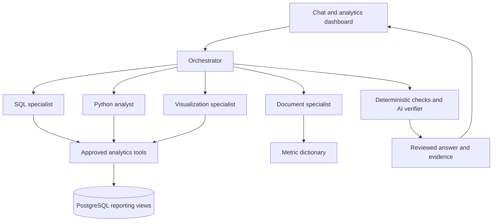

# CAUSYN — Evidence to Insight

**A multi-agent analytics workspace that turns questions about historical ecommerce data into checked answers, traceable evidence, and charts.**

[Explore the deployed app](https://causyn.onrender.com) · [Metric definitions](docs/metric_dictionary.md) · [Deployment guide](README_FREE_HOSTING.md)

Public **Demo** mode provides recorded examples without model requests. **Live** mode runs new investigations against PostgreSQL and Gemini and requires an owner access code.

## What it does

- Compares purchase months and reconciles category contributions to merchandise-value changes.
- Splits merchandise-value changes into order-volume and average-order-value contributions using Decimal arithmetic.
- Reports monthly trends, category and seller rankings, and delivery performance by customer state.
- Produces source-checked charts that render in the dashboard and open as standalone HTML reports.
- Retrieves metric definitions from project documentation and cites the retrieved sections.
- Requests missing dates and acknowledges unsupported periods or insufficient documentation.

The dataset is **Olist Brazilian ecommerce**, covering nine source CSVs. Default reporting includes delivered orders purchased from **January 2017 through August 2018**. Values are in **BRL**. Merchandise value excludes freight and is neither profit nor Olist's corporate revenue.

## Architecture



The application has **six roles**: an orchestrator and five specialists. Specialists have constrained responsibilities; they do not run unrestricted SQL or generated Python code. The document retrieval implementation uses keyword overlap with title weighting, rather than embedding-based vector retrieval.

| Role | Responsibility | Main file |
| --- | --- | --- |
| Orchestrator | Routes questions, collects evidence, and assembles answers | `agent.py` |
| SQL specialist | Plans approved, parameterized reporting operations | `sql_specialist.py` |
| Document specialist | Plans focused searches of the metric dictionary | `document_specialist.py` |
| Python analyst | Performs approved volume/value decomposition | `python_specialist.py` |
| Visualization specialist | Creates charts mapped to validated evidence | `visualization_specialist.py` |
| AI verifier | Reviews the answer against evidence, alongside deterministic checks | `verifier_specialist.py` |

## Data engineering and SQL

The warehouse separates source preservation, typed preparation, and reporting:

| Layer | Purpose |
| --- | --- |
| `raw` | Preserves the nine source tables for audit and comparison |
| `staging` | Applies types, documented interpretations, and quality flags |
| `analytics` | Exposes order-level and monthly reporting views |
| `app_state` | Stores hosted sessions, admission counters, and private chart artifacts separately from business data |

SQL aggregates multi-record items, payments, and reviews at the appropriate grain before order-level reporting. This avoids multiplying amounts through joins. The audit examines missing records, payment differences, review conflicts, timestamp anomalies, and relationships between source tables. Missing values and repeated records are interpreted in context rather than deleted indiscriminately.

The reporting layer supports month comparisons, period totals, category and seller rankings, and state-level late-delivery rates. Category and seller order counts can overlap and must not be summed into unique-order totals. State-delivery charts exclude groups with fewer than 30 assessable orders.

### Validated reporting baseline

| Metric | Result |
| --- | ---: |
| Source orders | 99,441 |
| Delivered orders in the reporting window | 96,211 |
| Delivered merchandise value | R$13,181,027.13 |
| Orders with assessable delivery | 96,203 |
| Late orders in the reporting window | 6,531 |
| Reporting purchase months | 20 |

The broader audit retains 303 orders with payment discrepancies, eight delivered orders without a delivery date, and 202 orders with conflicting review scores. These findings are not automatically classified as fraud, losses, or customer dissatisfaction.

## Verification and evidence

Verification operates at several levels:

1. **Warehouse checks:** row counts, totals, uniqueness, reporting coverage, and known baselines.
2. **Tool contracts:** approved operations, valid arguments, supported dates, and bounded plans.
3. **Numerical checks:** structured claims, units, scope, arithmetic, category reconciliation, and decomposition components.
4. **Chart checks:** plotted labels and values must map to the retrieved source evidence.
5. **Document reference checks:** citations in the expected format must refer to retrieved sections.
6. **AI review:** a verifier reviews the final answer against its evidence.

Checks and AI review reduce errors; they do **not** prove every sentence correct or establish causality. Document-reference validation checks citation identity, not semantic support for every claim. Replay evaluates saved responses and makes no model calls.

For November to December 2017, delivered merchandise value fell from **R$987,765.37** to **R$726,033.19**, a **26.50%** decrease. Category contributions and volume/value decomposition describe the arithmetic of that change, not proven business causes.

## Deployment and access

The deployed application uses **Starlette/Uvicorn**, a **Docker** image on **Render**, and **Neon PostgreSQL**. GitHub Actions runs offline checks and builds the image. Docker runs as a non-root user.

- `causyn_reader` has restricted reporting access; analytics run in read-only transactions with statement timeouts.
- `causyn_web` reads and writes website-state tables without receiving the business reporting permissions.
- Hosted Live requires an access code and uses secure, HttpOnly session cookies. Logout revokes the session.
- Jobs and charts are scoped to their issuing session. Hosted charts are stored in PostgreSQL, with a 24-hour lifetime; sessions last six hours.
- Default admission limits allow one concurrent Live investigation, 20 investigations per UTC day globally, and five per UTC clock hour per session.
- Request, tool-call, and timeout limits bound investigations. Cost estimates and admission limits are not hard monetary spending caps.

The app uses one instance and one Uvicorn process. Active jobs are held in memory and do not resume after a restart. Saved charts persist across redeployment for the same valid session. Browser history is session-local, not a durable account history.

## Run locally

Requires **Python 3.11**. From a checkout:

```bash
python3.11 -m venv .venv
source .venv/bin/activate
python -m pip install -r requirements.runtime.txt
cp .env.example .env
```

Configure the private environment for the selected mode. A recorded Demo preview does not need Gemini access. Live requires a working reporting database and a Gemini API key. Preserve any existing `.env` rather than overwriting it.

```bash
python web_app.py
```

Open `http://127.0.0.1:8765`. The runtime manifest pins direct dependencies; it is not a complete transitive, hash-locked environment.

### Database reproduction

Download the [Olist dataset](https://www.kaggle.com/datasets/olistbr/brazilian-ecommerce), place its nine CSVs in `data/raw/`, and create a local PostgreSQL database named `causyn`. The initial loader uses the original local owner username `aman`; adapt that connection for a different machine before running it. Inspection scripts additionally require pandas.

Load with `load_raw_data.py`, then use the numbered SQL scripts for auditing, staging, analytics, validation, and access control. Install the additional reporting views with `install_analysis_depth.py --user YOUR_LOCAL_OWNER`. The raw loader replaces the raw copy on reruns; use it on your intended project database.

For the hosted migration and durable-state setup, follow [README_FREE_HOSTING.md](README_FREE_HOSTING.md). Owner credentials are for manual administration, not the application runtime.

### Private configuration

| Variable | Purpose |
| --- | --- |
| `DATABASE_URL` | Restricted analytics reader connection |
| `CAUSYN_STATE_DATABASE_URL` | Separate hosted website-state connection |
| `GEMINI_API_KEY` | Server-side Gemini access |
| `CAUSYN_ACCESS_CODE` | Hosted Live sign-in code |
| `CAUSYN_LIVE_ENABLED` | Enables or disables Live investigations |

Never commit `.env`, credentials, database dumps, or raw dataset files. In Render's environment-value fields, paste values without the surrounding quotes used in `.env` syntax. Hosted database URLs must explicitly enable TLS.

## Evaluation

```bash
# Offline web checks: no Gemini requests
python deployment_checks.py
python free_hosting_checks.py
python evaluate_depth.py --self-test

# Database-backed checks: no Gemini requests
python check_runtime_database.py
python evaluate.py
python evaluate_depth.py --database

# Live evaluations: use Gemini and may incur charges
python evaluate.py --live
python evaluate_depth.py --live --case categories
```

Reports are saved under `evaluations/results/`. In the deployed smoke tests, document retrieval, known category totals, chart delivery, sign-out protection, chart persistence after redeployment, and mobile presentation were checked. These checks cover the tested paths, not every possible question.

## Project map

| Path | Contents |
| --- | --- |
| `sql/` | Audit, staging, analytics, validation, access control, and reporting SQL |
| `docs/metric_dictionary.md` | Metric definitions and interpretation rules |
| `analytics_tools.py`, `depth_tools.py` | Approved database operations |
| `verification.py`, `depth_contracts.py` | Deterministic verification and contracts |
| `depth_visuals.py` | Trend and ranking chart rendering |
| `ui/` | Responsive chat and analytics interface |
| `web_app.py`, `web_access.py` | Web endpoints, sessions, admissions, and chart access |
| `Dockerfile`, `render.yaml` | Container and hosting configuration |

## Scope and limitations

- Built for the Olist schema and historical reporting window; other datasets require adapters and validation.
- Each question is an independent investigation. The visible history does not provide multi-turn analytical memory.
- Approved tools constrain analysis: the system does not execute arbitrary SQL, generated code, or arbitrary chart specifications.
- No forecasting, real-time commerce integration, causal inference, refund-policy knowledge, or production multi-user account system is claimed.
- Hosting can pause when idle, and provider/API quotas can affect availability. Demo examples remain distinct from live investigations.
- Saved charts are private to the issuing session and expire; they are not permanent public report links.

## Dataset attribution

Source: [Brazilian E-Commerce Public Dataset by Olist](https://www.kaggle.com/datasets/olistbr/brazilian-ecommerce). Raw data is downloaded separately and is not redistributed in this repository. Consult the source dataset's license and terms before reuse.
